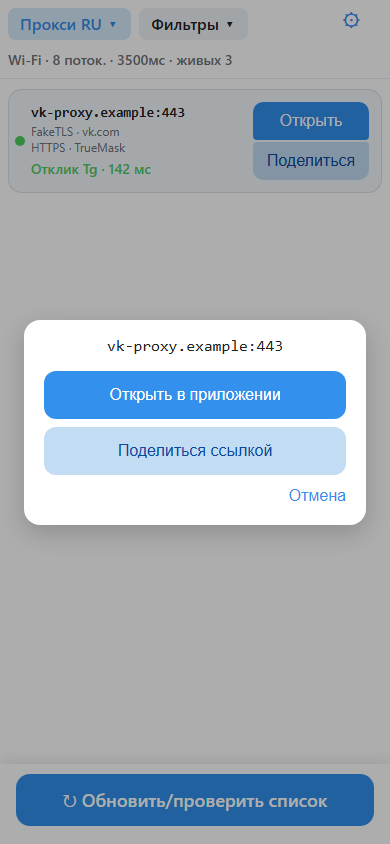
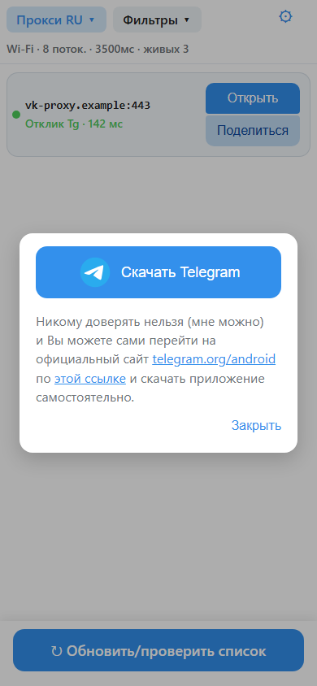

# Выручайка

Выручайка помогает открывать мир, проверяет и показывает запасные пути с вашего Андроида.

**Скачать последнюю сборку:** [GitHub](https://github.com/ilexahub/MTProSearch/releases/latest) · [GitVerse](https://gitverse.ru/ilexa/MTProSearch/releases)

**[Как установить](docs/kak-ustanovit.md)** Подробности — пошагово, простым языком.

## Установка

Краткая памятка:

1. Скачайте APK с телефона. Android 8.0 и новее.
2. Разрешите установку из этого источника (браузер или файловый менеджер).
3. Откройте файл и установите.

Play Protect может показать «неизвестный разработчик»: подпись не из Google Play, это ожидаемо.

  
  
  
  

**MTProSearch (Выручайка)** — Android-приложение, которое скачивает публичные списки и перепроверяет их с сети вашего андроид.

На GitVerse нет `/releases/latest`. Берите [верхний релиз в списке](https://gitverse.ru/ilexa/MTProSearch/releases) или открывайте постоянную памятку [текущая сборка](docs/latest.md).

В список по-умолчанию попадают только FakeTLS с белых сайтов: VK, Сбер, Госуслуги, Яндекс, Mail.ru, OK, банки, маркетплейсы.
Понимает ссылки tg://proxy и t.me/proxy.

**Проверка**
Галки **Proxy RU / EU / All** выбирают, какие списки качать. По умолчанию RU.
**Сортировка:** ретрансляция → секрет принят → VK/Сбер/Госуслуги выше маркетплейсов → пинг.
На Wi‑Fi проверка быстрее и параллельнее, на LTE — осторожнее. На один хост — один сокет.

**Ограничения**

HMAC не гарантирует, что доступ у вас откроется (DPI после прокси, бан IP, перегруз). req_pq ближе к «ретранслирует в DC», но без входа в аккаунт.
