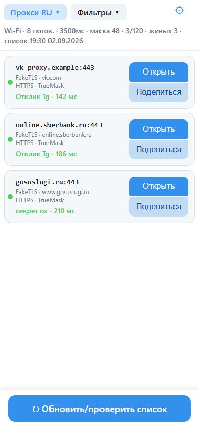
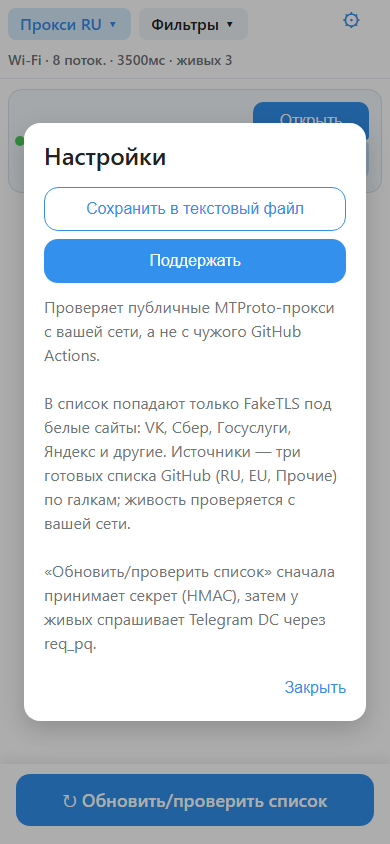
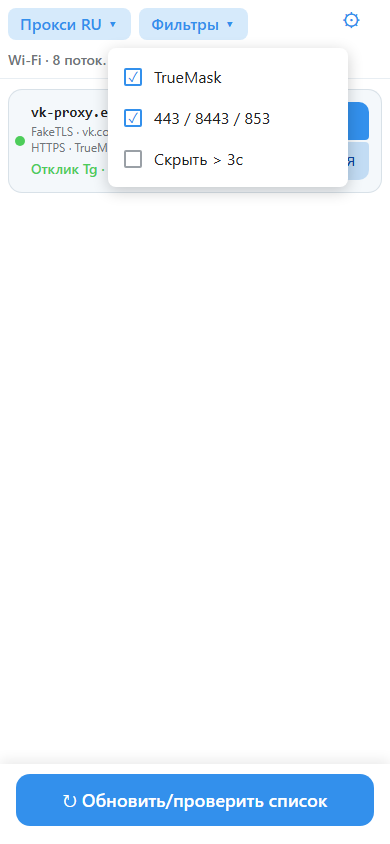

# MTProSearch

**Скачать последнюю сборку:** [Releases](https://github.com/ilexahub/MTProSearch/releases/latest)

## Установка

1. Скачайте APK с телефона. Android 8.0 и новее.
2. Разрешите установку из этого источника (браузер или файловый менеджер).
3. Откройте файл и установите.

Play Protect может показать «неизвестный разработчик»: подпись не из Google Play, это ожидаемо.

  
  
  

**MTProSearch** — Android-приложение, которое скачивает публичные списки MTProto-прокси и перепроверяет их с сети вашего телефона.

В список попадают только FakeTLS с SNI белых сайтов: VK, Сбер, Госуслуги, Яндекс, Mail.ru, OK, банки, маркетплейсы. Голый .ru не проходит.
Понимает ссылки tg://proxy и t.me/proxy.

**Проверка**

**«Обновить список»** - TCP + FakeTLS HMAC: прокси принял секрет или это чужая HTTPS-маска (domain fronting).
**«Полная проверка»** - obfuscated2 + req_pq до DC Telegram, только у тех, кто уже прошёл HMAC.
**Сортировка:** ретрансляция в Telegram → секрет принят → VK/Сбер/Госуслуги выше маркетплейсов → пинг.
На Wi‑Fi проверка быстрее и параллельнее, на LTE — осторожнее. На один хост — один сокет.

**Ограничения**

HMAC не гарантирует, что Telegram у вас откроется (DPI после прокси, бан IP, перегруз). req_pq ближе к «ретранслирует в DC», но без входа в аккаунт.
